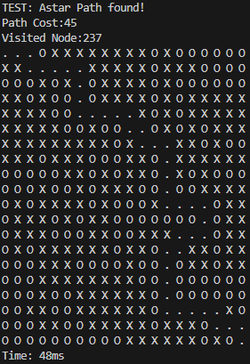
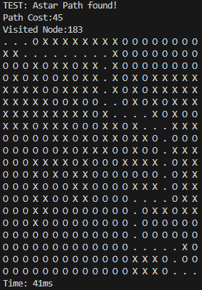
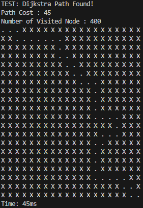
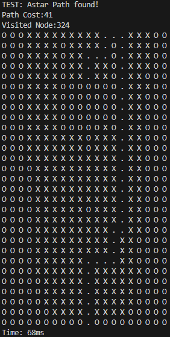
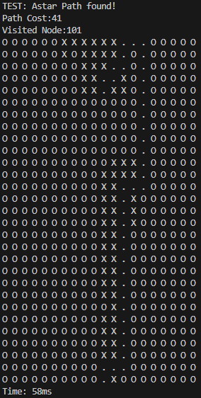
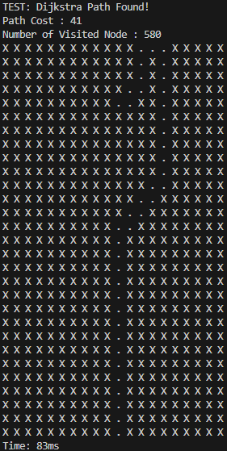

# Path_planning_study

### Topic: Study path planning algorithms and theory of autonomous driving 

---
### Development & Study Schedule
* Feb.2024 ~ Present

### Goal
1. Study of Path Planning Algorithm
2. Implement algorithm and study differences between each algorithm

### Final Goal
1. Optimize the algorithm
2. Apply algorithm to Robot and analyze performance

---

### Directory
* **Algorithm**
  * Contains path planning algorithm
* **Algorithm_with_TestCase**
  * Contains path planning algorithm with test cases

---

## Example Result

### TEST CASE 1
* Fig 1 : Astar(Euclidean)
* Fig 2 : Astar(Manhattan)
* Fig 3 : Dijkstra

  
  
  

Explanation
* About result map
  * O: Not visited Node
  * X: Visited Node
  * .: Path (Result of algorithm)
* Fig 1, Fig 2 is Result of Astar algorithm (/Algorithm_with_TestCase/Astar_Test_algorithm.cpp)
* Fig 3 is Result of Dijkstra algorithm (/Algorithm_with_TestCase/Dijkstra_Test_algorithm.cpp)
* 3 algorithms used same map (named "maze" in code)
* 3 algorithms results same cost but small difference in path and runtime
* Dijkstra (Fig 3)'s result shows that it visited every node
* Astar (Fig1, 2)'s result shows that it didn't visited every node
* In this Test Case Astar(Manhattan) results efficient in time

---
### TEST CASE 2
* Fig 1 : Astar(Euclidean)
* Fig 2 : Astar(Manhattan)
* Fig 3 : Dijkstra

  
  
  

Explanation
* About result map
  * O: Not visited Node
  * X: Visited Node
  * .: Path (Result of algorithm)
* Fig 1, Fig 2 is Result of Astar algorithm (/Algorithm_with_TestCase/Astar_Test_algorithm.cpp)
* Fig 3 is Result of Dijkstra algorithm (/Algorithm_with_TestCase/Dijkstra_Test_algorithm.cpp)
* 3 algorithms used same map (named "maze" in code)
* 3 algorithms results same cost but small difference in path and runtime
* Dijkstra (Fig 3)'s result shows that it visited every node
* Astar (Fig1, 2)'s result shows that it didn't visited every node
* Test Case 2 is bigger than Test Case 1
  * Dijkstra algorithm has longer runtime using Test case1 than using Test case2 
* In this Test Case Astar(Manhattan) results efficient in time

 

---
## + Studying More Deeply..

